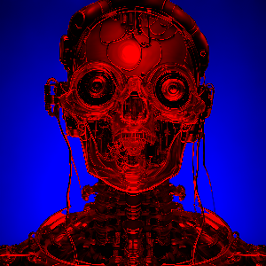

# ChromoStereoizer

_Generate Chromostereopsis images from Depth._

## Table of Contents

- [Overview](#overview)
- [Dependencies](#dependencies)
- [Installation](#installation)
- [Usage](#usage)
- [Pre-trained Models](#pre-trained-models)
- [License](#license)
- [Contact](#contact)

## Overview

Generate Chromostereopsis images from Depth, using [Depth-Anything-V2](https://github.com/DepthAnything/Depth-Anything-V2).

## Dependencies

All dependencies required for this project are listed below and will be automatically installed in a venv using the install.bat provided :
torch,
numpy,
pillow,
PySide6,
transformers,
A working Depth-Anything-V2 install

## Installation

### Windows

1. **Install Python 3.10.10 or Newer:**
   [Python 3.10.10](https://www.python.org/downloads/release/python-31010/)

2. **Install Git:**
   [Git](https://git-scm.com/downloads)

2. **Git Clone this repo:**
   git clone https://github.com/qseptq7qsept/ChromoStereoizer.git

4. **Run the Installation Script:**  
   Execute `install.bat` to install all necessary components.

## Usage

To run the project:

1. **Execute the Run Script:**  
   Simply run `run.bat` from your command prompt or just double-click on it.

## Examples
  

## Pre-trained Models

For more details on pre-trained models used in this project, please refer to the [Depth-Anything-V2 pre-trained models section](https://github.com/DepthAnything/Depth-Anything-V2?tab=readme-ov-file#pre-trained-models).

## License

Apache-2.0 license

## Contact

For questions, feedback, or contributions, please feel free to open an issue. -q7
